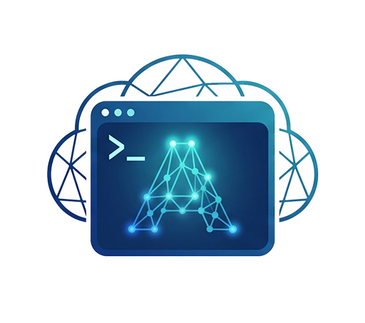

# Disposable cloud Codex workers

<p align="center">
  
</p>

`vps` is a Rust control plane for disposable DigitalOcean development workers. Each worker gets an isolated Ubuntu machine, one repository checkout, a repository-scoped GitHub credential, Docker access, and persistent Codex remote control.

## Motivation

This project moves agent-driven development off the developer's laptop and onto one disposable machine per unit of work.

**Keep the agent off the developer machine.** A coding agent can run arbitrary commands, install dependencies, execute repository code, and access the credentials available to its process. That is a poor fit for a laptop containing personal files, cloud credentials, SSH keys, and unrelated client work. A worker receives only the checkout and credentials needed for one repository. The DigitalOcean token remains on the control machine and is never copied to the worker.

**Run work in parallel instead of in series.** Independent workers do not contend for one checkout, one Docker daemon, one dependency tree, or the same ports. Separate features, repositories, experiments, and long-running migrations can proceed at the same time. Throughput is limited by what you are willing to pay for and supervise rather than by one local machine.

**Give every copy its own operating system.** Each worker boots from a clean Ubuntu image provisioned by the same cloud-init asset. Every copy can bind conventional ports, run its own databases and containers, and install system packages without coordinating with another agent. Damage is contained to one disposable machine; recovery is pause/resume or teardown rather than repairing a shared host.

**Note:** Some AI coding tools are already adding built-in support for remotely hosted agents, which may provide a more refined and easier-to-use experience. See Amp's [Agents in Orbs](https://ampcode.com/news/agents-in-orbs for one such example).

## Security and cost model

- A Droplet remains billable until `vps destroy` or `vps pause` confirms its deletion. 
- `vps pause` is a cold suspend. It quiesces the worker, snapshots the boot disk, and deletes the Droplet. Compute billing stops after confirmed deletion (private snapshot storage remains billable, but is much less expensive).
- A paused snapshot contains the checkout, databases, GitHub PAT, and ChatGPT login. Treat it as a credential-bearing private machine image; never share or publish it. Normal resume and destroy remove it.
- Each instance uses a dedicated fine-grained GitHub PAT restricted to its repository. The worker keeps that credential for Git and `gh`; the control machine retains a mode-`0600` copy so teardown can revoke it if the worker is unreachable.
- Repository code running as `agent` can read the worker's GitHub and ChatGPT credentials and has root-equivalent control through the Docker socket. Use only repositories and dependencies you trust.
- Cloud-init authorizes the configured SSH key for the unprivileged `agent` user, disables root SSH login, and does not install the DigitalOcean token.
- Initial SSH bootstrap uses trust on first use with an instance-specific known-hosts file. This does not protect the first connection from an active network attacker.

## Install

Tagged releases publish checksummed archives for macOS arm64 and Windows x64 plus Ubuntu amd64 `.deb` packages. Release assets include shell completions, third-party notices, CycloneDX SBOMs, and build provenance.

To build from source, install Rust 1.96.1 and OpenSSH, then run:

```bash
rustup toolchain install 1.96.1 --component rustfmt,clippy
cargo build --locked --release
./target/release/vps --help
```

The executable calls the DigitalOcean REST API directly. Normal operation does not require `doctl`, local `gh`, or local `jq`. When available, `doctl` can provide the SSH-key default during first-run setup. OpenSSH is required for worker setup and interactive shells.

## Configure

`vps` initializes itself on first use. If the selected VPS home or its `vps.toml` is missing, run any command from an interactive terminal—for example:

```bash
vps list
```

The setup sequence asks for:

- the private SSH key path;
- Git author name and email, pre-populated from `git config user.name` and `git config user.email` when available;
- the matching DigitalOcean SSH key ID or fingerprint, pre-populated when `doctl` reports exactly one account key;
- DigitalOcean region, size, image, tags, and Droplet name prefix.

Press Enter to accept each displayed default. Setup creates `~/.vps` with mode `0700` and writes the populated configuration to `~/.vps/vps.toml` with mode `0600`. 

With multiple account keys, setup displays their IDs, fingerprints, and names so you can choose one at the prompt. With no keys, or when `doctl` is unavailable or unauthenticated, setup leaves the SSH-key choice for you to enter. To list the same information manually when `doctl` is installed:

```bash
doctl compute ssh-key list --format ID,FingerPrint,Name
```

The public key must exist beside the private key with a `.pub` suffix. If the private key is encrypted, load it into your SSH agent before creating a worker:

```bash
ssh-add --apple-use-keychain ~/.ssh/id_digitalocean
```

First-run setup requires an interactive terminal and never stores DigitalOcean or GitHub tokens.

### Minimum DigitalOcean token scopes

Create a custom-scoped DigitalOcean personal access token and enable every entitlement group listed below. See DigitalOcean's [custom scope reference](https://docs.digitalocean.com/reference/api/scopes/) for current definitions and dependencies.

| Entitlement group | Required scopes | Purpose and dependency notes |
| --- | --- | --- |
| Actions | `actions:read` | Poll asynchronous lifecycle operations. Required by the Droplet create/delete scopes and by `snapshot:delete`. |
| Droplets | `droplet:create`, `droplet:read`, `droplet:update`, `droplet:delete` | Create, inspect, shut down, and destroy workers. `droplet:read` is also required by `snapshot:delete`. |
| Images | `image:create`, `image:read`, `image:delete` | Create and remove private recovery images. `image:read` is required by the Droplet create/delete scopes and by `snapshot:delete`; `image:delete` is also required by `snapshot:delete`. |
| Regions | `regions:read` | Resolve eligible regions. Required by the Droplet create/delete scopes and by `snapshot:delete`. |
| Sizes | `sizes:read` | Resolve eligible Droplet sizes. Required by the Droplet create/delete scopes and by `snapshot:delete`. |
| Snapshots | `snapshot:read`, `snapshot:delete` | Verify and remove private recovery snapshots. `snapshot:read` is required by `snapshot:delete`. |
| SSH keys | `ssh_key:read` | Discover the sole account key when none is configured and add the selected key to new Droplets. It also permits the optional `doctl compute ssh-key list` reference command above. |
| Tags | `tag:create`, `tag:read` | Apply configured tags during creation. `tag:read` is required by `tag:create`. |
| VPCs | `vpc:read` | Satisfy the additional dependency enforced by DigitalOcean's token-creation UI. |

No broad full-access entitlement is required. The worker monitoring agent does not require `monitoring:create`; that entitlement creates alert policies, which this project does not manage.

Validate local configuration and provider access before allocating:

```bash
vps doctor
```

## Lifecycle

### Create a worker

Generate a new name automatically:

```bash
vps create example-org/testrepo --branch main
```

Or choose a stable name:

```bash
vps create --name frontend-a example-org/testrepo --branch main
```

Creation:

1. Persists allocation intent before calling DigitalOcean.
2. Creates the Droplet and waits for its public IP, SSH, cloud-init, and Docker.
3. Prompts for a dedicated fine-grained GitHub PAT and validates its repository access.
4. Clones the repository under `/home/agent/projects` and creates `codex/<instance-id>`.
5. Runs ChatGPT device login when needed and starts Codex remote control.

The pre-filled GitHub PAT form requests a two-day expiry, access only to the selected repository, `Contents: read and write`, `Pull requests: read and write`, `Actions: read`, and `Commit statuses: read`. Confirm any organization approval requirement before continuing. Pasted token input is not echoed.

Creation prints its generated or selected name before allocation begins. If creation is interrupted, rerun with `create --name <name> ...`, using that same name, repository, and base branch. The persisted journal reconciles the existing allocation instead of blindly creating another Droplet. Use `vps destroy <instance>` to abandon an incomplete setup.

### Inspect and connect

```bash
vps list
vps status frontend-a
vps status frontend-a --refresh
vps shell frontend-a
```

`list` and `status` read local state by default. `status --refresh` performs a read-only provider lookup. `shell` connects directly as `agent` using the recorded endpoint, configured private key, and instance-specific known-hosts file.

Lifecycle progress is written to stderr; the result and next useful command are written to stdout. Add `--verbose` for provider IDs, addresses, snapshots, and extended list columns. Use `--output json` for the complete versioned state object. Set `NO_COLOR` to disable terminal color.

### Pause and resume

```bash
vps pause frontend-a
vps list
vps resume frontend-a
vps shell frontend-a
```

Pause is a cold boot cycle, not a RAM suspend. Running processes are lost. Before shutdown, `vps` stops Codex remote control, records running and healthy Docker containers, gracefully stops them, runs `sync`, captures the SSH host key, powers off the Droplet, creates and verifies a private boot-disk snapshot, and deletes the source Droplet. After a completed shutdown action, it polls the Droplet resource until the provider reports it powered off, tolerating normal status propagation delay before snapshotting.

Do not pause while another operator or process is writing through SSH. The lifecycle lock serializes `vps` commands but cannot stop an unrelated shell from changing the disk. Attached DigitalOcean block-storage volumes are rejected because a Droplet snapshot does not include them; Docker volumes stored on the boot disk are preserved.

Resume creates a replacement Droplet from the recorded snapshot using the original region and size. Its provider ID and public IP change. `vps` verifies the preserved SSH host key, restores the containers that were running, waits for previously healthy containers, verifies the checkout and credentials, restarts remote control, and deletes the snapshot only after recovery succeeds.

If the two-day GitHub PAT expires while paused, resume prompts for and validates a replacement. The replacement journal is retained until the old credential is revoked.

### Destroy a worker

```bash
vps destroy frontend-a
```

Destroy inventories every active, source, replacement, and snapshot resource recorded in the lifecycle journal. It confirms all possible Droplets are absent before revoking GitHub credentials, removes any retained snapshot, and deletes local instance state only after cleanup is confirmed.

Run destroy when work is complete and after any abandoned create, pause, or resume attempt. Remove the remote environment from the controlling Codex/ChatGPT client separately if it remains listed there.

## Interruption and recovery

Every provider mutation is journaled before submission. A lost response is reconciled through persisted resource IDs, action IDs, and unique lifecycle tags:

- Zero matching resources remains uncertain.
- Exactly one identity-verified match is adopted.
- Multiple matches fail closed and require operator inspection.

Rerun the same command after interruption. Never delete local state to bypass an uncertain operation; doing so can orphan billable resources and credential-bearing snapshots.

DigitalOcean `404` responses are treated conservatively because they can mean either a missing resource or access through the wrong account. After independently verifying the account and exact resource absence, use the confirmation flag requested by the error:

- `--confirm-missing-server`
- `--confirm-missing-snapshot`
- `--confirm-request-not-accepted`

Use `--forget-unresolved-allocation` only after independently confirming that no resource exists for a retained allocation intent. Use `--forget-unrevoked-token` only after manually revoking the retained GitHub credential or knowingly accepting its remaining expiry window.

`vps list` reports transitional states such as `pausing-snapshot`, `resuming-recovery`, and `active-snapshot-cleanup-pending`. Shell access is refused during unsafe phases. If only snapshot cleanup remains, the worker stays usable and rerunning `vps resume <instance>` retries cleanup without allocating another Droplet.

## Multiple concurrent workers

One TOML file is a reusable infrastructure profile. Each instance receives its own Droplet, checkout, `codex/<instance-id>` branch, GitHub credential, known-hosts file, lifecycle journal, and lock.

```bash
vps create --name frontend-a example-org/frontend --branch main
vps create --name backend-a example-org/backend --branch develop
vps list
vps shell frontend-a
vps pause backend-a
vps destroy frontend-a
```

Operations on one instance are serialized; independent instances can proceed concurrently.

## Shell completion

Generate a completion script for the current shell, for example:

```bash
source <(vps completion zsh)
```

Run `vps completion --help` for the supported shells.
